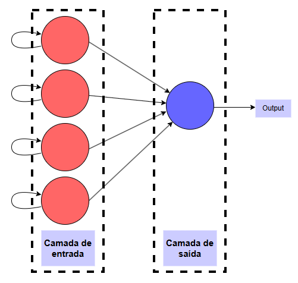
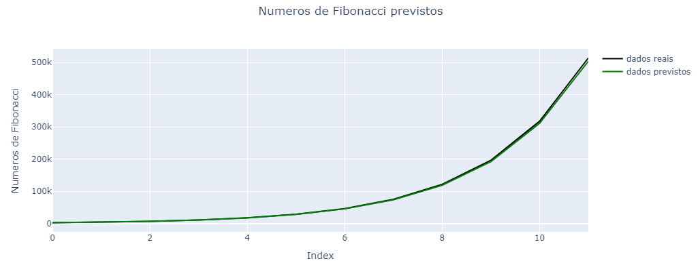

--- 
layout: post
title: "LSTM Neural Networks explained for beginners with Fibonacci serie and Tensorflow"
date: 2024-12-21 00:00:00 -0300
categories: Neural-Networks AI Recurrency-Neural-Networks Deep-Learning LSTM
tag: [Artificial-Neural-Networks, Machine-Learning, Deep-Learning, AI]
---

<!--
Este sript html é necessário para a página estática do jekyll conseguir renderizar o código LaTex
-->
<script type="text/javascript" id="MathJax-script" async
        src="https://cdn.jsdelivr.net/npm/mathjax@3/es5/tex-mml-chtml.js">
</script>

<script>
    MathJax = {
        tex: {
            inlineMath: [['$', '$'], ['\\(', '\\)']],
            displayMath: [['$$', '$$'], ['\\[', '\\]']]
        }
    };
</script>
<!--
Este sript html é necessário para a página estática do jekyll conseguir renderizar o código LaTex
-->


As **redes LSTM** (_Long Short-Term Memory_) são um tipo especial de rede neural recorrente (_RNN_) projetado para lidar com problemas relacionados a séries temporais e dados sequenciais. Elas foram introduzidas em 1997 por Sepp Hochreiter e Jürgen Schmidhuber para resolver a limitação principal das RNNs tradicionais: a incapacidade de lembrar informações de longo prazo devido ao **problema do desvanecimento** ou **explosão de gradientes** durante o treinamento.

## Estrutura e algoritmo


A principal inovação do LSTM é a introdução de **células de memória** e **portas** que controlam o fluxo de informações dentro da rede. Essas portas ajudam o modelo a decidir quais informações devem ser mantidas, atualizadas ou esquecidas ao longo do tempo.

- **Célula de memória:**   
    A célula de memória é responsável por armazenar informações ao longo do tempo. Ela pode reter valores por longos períodos, o que é útil para capturar dependências de longo prazo.

- **Três portas principais:**  
- **Porta de esquecimento ($f_t$):** Decide quais informações antigas na célula de memória devem ser descartadas. É calculada por:  

$$
f_t = \sigma(W_f \cdot [h_{t-1}, x_t] + b_f)
$$

  - **Porta de entrada ($i_t$):** Determina quais novas informações serão armazenadas na célula de memória:  

$$
i_t = \sigma(W_i \cdot [h_{t−1}, x_t] + b_i)
$$

Uma função de ativação (geralmente tangente hiperbólica) gera os valores candidatos para serem adicionados:  

$$
\tilde{C}_t = \tanh(W_C \cdot [h_{t−1} , x_t ]+ b_C )
$$

  - **Porta de saída ($o_t$):** Decide quais informações da célula de memória serão usadas para calcular a saída:  

$$
o_t​ =σ(W_o​ \cdot [h_{t−1} ,x_t ] + b_o)
$$

A saída final é modulada por uma tangente hiperbólica:  

$$
h_t = o_t \cdot \tanh(C_t)
$$

  - **Atualização da Célula de Memória ($C_t$):**
A célula de memória é atualizada com base nas portas de entrada e esquecimento:  

$$
C_t =f_t \cdot C_{t−1} + i_t \cdot \tilde C_t
​$$


Este [vídeo](https://youtu.be/uixq2f5gVms?si=nDLqm0CzxCjl_LEb) apresenta uma explicação didática e completa sobre a arquitetura e algoritmo das redes Long Short-Term Memory (LSTM).

## Exemplo usando série de Fibonacci

### Breve contexto sobre as séries de Fibonacci

A **série de Fibonacci** é uma sequência numérica famosa em que cada número, a partir do terceiro, é a soma dos dois anteriores. A série começa com os valores $\( 0 \)$ e $\( 1 \)$, gerando a sequência: $\( 0, 1, 1, 2, 3, 5, 8, 13, 21, \dots \)$. Por ser construída de forma iterativa, ela é um ótimo exemplo de **dados sequenciais**, onde o valor atual está condicionado aos valores que o precedem. Essa natureza sequencial torna a série de Fibonacci ideal para estudos de algoritmos que lidam com dependências temporais, como redes neurais recorrentes (RNNs) e LSTMs, que são projetadas para capturar relações entre elementos consecutivos em séries temporais.


### Tratamento dos dados

Este exemplo foi implementado em python 3.8.8, usando as bibliotecas Numpy na versão 1.19.5 e Tensorflow na versão 2.3.0. Você encontra o código original deste exemplo neste [repositório](https://github.com/jeffersonrafael/LSTM_SERIE_FIBONACCI).

Inicialmente, eu construi uma função para gerar os números desta série e o conjunto de dados.

```python
def fibonacci_lista(n): # Função geradora de numeros de fibonacci
    if n <= 0:
        return "O número deve ser maior que zero."
    elif n == 1:
        return [0]
    elif n == 2:
        return [0, 1]
    else:
        fib = [0, 1]
        while len(fib) < n:
            fib.append(fib[-1] + fib[-2])
        return fib
```

O dataset foi gerado com 30 amostras, ou seja, eu gerei uma série com __n = 30__ números de Fibonacci. Como no código abaixo:

```python
dados_t = fibonacci_lista(30)
```

Antes de construir o modelo de deep learning, nós precisamos tratar os dados adequadamente para extrair a melhor performance do algoritmo. No código abaixo, eu separo os dados em conjunto de treinamento, validação e teste. 

```python
conj_treino = dados_t[:10]
conj_valid = dados_t[10:15]
conj_teste = dados_t[15:30]

# Construindo os arrays
conj_treino = np.array(conj_treino, dtype='int32')
conj_valid = np.array(conj_valid, dtype='int32')
conj_teste = np.array(conj_teste, dtype='int32')

conj_treino = conj_treino[:, np.newaxis]
conj_valid = conj_valid[:, np.newaxis]
conj_teste = conj_teste[:, np.newaxis]
```

Em seguida, eu organizo os dados numa estrutura de tensor para o Tensorflow.

```python
X_treino = []
y_treino = []
for i in range(3, conj_treino.shape[0]):
    X_treino.append(conj_treino[i-3:i, 0])
    y_treino.append(conj_treino[i, 0])

X_treino, y_treino = np.array(X_treino), np.array(y_treino)

X_treino = np.reshape(X_treino, (X_treino.shape[0], X_treino.shape[1], 1))
```

### Construção do modelo

Considerando a trivialidade do problema, a rede neural construída possui uma arquitetura extremamente simples. Basicamente, é uma rede neural artificial com 4 neurônios (Células de memória) na camada de entrada e 1 um neurônio na camada de saída. A figura abaixo, mostra uma representação visual da arquitetura da rede neural construida.  
_OBS.: Ficou faltando adicionar o bias na figura._




Abaixo nós temos a construção da rede neural da figura acima em python.

```python
modelo_fibonacci = Sequential()

modelo_fibonacci.add(LSTM(units=4, input_shape = (X_treino.shape[1], 1), activation='relu')) # Camada LSTM

modelo_fibonacci.add(Dense(units=1)) # Camada saida

modelo_fibonacci.compile(optimizer=Adam(lr=0.01), 
                         loss='mean_absolute_error', metrics=['mse'])

modelo_fibonacci.fit(X_treino, y_treino, epochs=100, batch_size=10, verbose=1, validation_data=(X_valid, y_valid))
```


### Avaliação do modelo

Arbitrariamente, a métrica __mean absolute error__, foi utilizada para atualizar os parâmetros do modelo. Enquanto que a __mean square error__ foi usada para avaliar o modelo. O modelo foi treinado em 100 épocas.

Em geral, o modelo apresentou um erro relativo de 2.75%. Ou seja, geralmente o modelo cria uma estimativa dentro da margem de erro de 2.75% em relação ao valor real. O gráfico abaixo, mostra a comparação dos números de Fibonacci estimados pelo modelo vs os números de Fibonacci reais.

