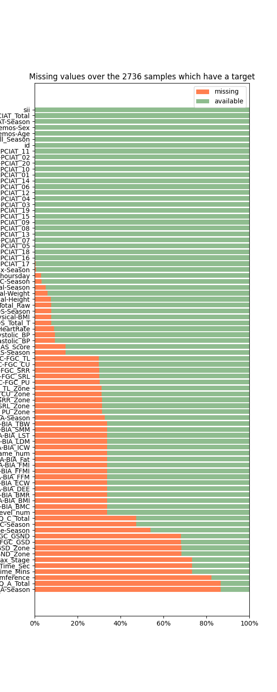

--- 
layout: post
title: "Melhorando o Diagnóstico e o Tratamento Mental com Marcadores Biológicos e IA"
date: 2024-12-28 00:00:00 -0300
categories: Neural-Networks Health Deep-Learning 
tag: [Artificial-Neural-Networks, Machine-Learning, Deep-Learning, AI, Health]
image: /assets/CMI_PIU/cmi-image.png # Caminho para a imagem
comments: true
---

<!--
Este sript html é necessário para a página estática do jekyll conseguir renderizar o código LaTex
-->

<!--
Este sript html é necessário para a página estática do jekyll conseguir renderizar o código LaTex
-->

---

Você sabia que sua **atividade física** e o **uso da internet** podem revelar muito sobre sua **saúde mental**? Em uma competição no Kaggle, valendo o **prêmio máximo de $15.000,00**. Cientistas de dados do mundo todo se uniram em uma corrente do bem, para construir um modelo de inteligência artificial que conseguisse melhorar o **diagnóstico e o tratamento de saúde mental** e **transtornos de aprendizagem** a partir de **marcadores biológicos**. 

## **Agradecimentos** ❤️

Primeiramente, gostaria de agradecer aos organizadores Child Mind Institute ao apoio financeiro foi fornecido pelo **California Department of Health Care Services (DHCS)** como parte da [**Children and Youth Behavioral Health Initiative (CYBHI)**](https://healthybrainnetwork.org/), ao **Kaggle** e aos patrocinadores **Dell** e a **NVidia** por tornarem esta competição possível. Lidar com dados ruidosos do mundo real foi uma experiência desafiadora e gratificante.  

## **Introdução**

É possível prever **o nível de uso problemático da internet exibido por crianças e adolescentes, com base em sua atividade física?** O objetivo desta competição é desenvolver um modelo preditivo que analise os dados de atividade física e aptidão física das crianças para **identificar sinais precoces de uso problemático da internet**. Identificar esses padrões pode ajudar a desencadear **intervenções para incentivar hábitos digitais mais saudáveis**.

O conjunto de dados Healthy Brain Network (HBN) é uma amostra clínica de cerca de cinco mil crianças e jovens de 5 a 22 anos que passaram por exames clínicos e de pesquisa. O objetivo do estudo HBN é encontrar **marcadores biológicos** que irão melhorar o **diagnóstico** e o **tratamento de saúde mental e transtornos de aprendizagem** de uma perspectiva **biológica objetiva**. Dois elementos deste estudo estão sendo usados ​​para esta competição: dados de atividade física (dados de acelerômetro usado no pulso, avaliações de condicionamento físico e questionários) e dados de comportamento de uso da internet.  

Em busca de uma solução acessível para diagnosticar a saúde mental dos jovens, o Child Mind Institute, em parceria com a Dell e a NVidia, lançou um desafio global com a participação de mais de 3000 especialistas em ciência de dados. O objetivo é encontrar marcadores biológicos que irão melhorar o diagnóstico e o tratamento de saúde mental e transtornos de aprendizagem de uma perspectiva biológica objetiva de mais de 5000 jovens como uma proxy para prever o nível de uso da internet e, com essa informação, realizar ações preventivas para mitigar ou reverter o quadro dos pacientes.

O objetivo desta competição é prever a partir desses dados o **Índice de Comprometimento de Gravidade** (_sigla em inglês_ **sii**) de um participante, uma medida padrão de uso problemático da internet.  

## **Materiais e Metodologia** 👨‍💻

### **Descrição do Dataset** 

Na versão pública, foi fornecido alguns dados de amostra no formato correto para ajudar a criar suas soluções. O conjunto de teste oculto completo é dividido por cerca de 38% destinado para definir a leaderboard pública e 62% destinado para definir a leaderboard privada.

Os dados da competição são compilados em duas fontes: arquivos **.parquet** contendo as séries do acelerômetro (actigraph), obtidas a partir de [smartwatch proprietário](https://theactigraph.com/actigraph-wgt3x-bt) que coleta os dados de atividade e os arquivos **.csv**, contendo os dados tabulares restantes com informações sobre a saúde física, demografia e horas de internet. A maioria das medidas está ausente para a maioria dos participantes. Em particular, a variável alvo **sii** está ausente para uma parte dos participantes no conjunto de treinamento. Técnicas de aprendizado não supervisionado podem ser aplicados a esses dados, com a intenção de preencher os valores ausentes nestas features. **O valor sii está presente para todas as instâncias no conjunto de teste**.

A coleta de dados com smartwatch que possuem uma configuração chamada **idle_sleep_mode**. Quando essa configuração está ativada, o relógio não registra dados durante períodos de inatividade, como sono ou tempo ocioso, o que causa lacunas nos dados. Isso dificulta a detecção de períodos em que o relógio não está sendo usado. Além disso, os sensores secundários, como **luz** e **voltagem da bateria**, são medidos em taxas de amostragem diferentes e, para fins de exportação, foram interpolados para corresponder à taxa de amostragem de 5 segundos, o que pode causar variações nos dados. O organizador da competição **recomendou cautela** ao usar os dados de **luz** interpolados durante esses intervalos de tempo, pois eles não seriam indicativos de dados reais.

Os dados tabulares em train.csv e test.csv compreendem medições de uma variedade de instrumentos. Os campos dentro de cada instrumento são descritos em data_dictionary.csv. Esses instrumentos são:

- **Demografia**: Informações sobre idade e sexo dos participantes.
- **Uso da Internet**: Número de horas de uso do computador/internet por dia.
- **Escala de Avaliação Global Infantil**: Escala numérica usada por clínicos de saúde mental para avaliar o funcionamento geral de jovens menores de 18 anos.
- **Medições Físicas**: Coleta de pressão arterial, frequência cardíaca, altura, peso e medidas de cintura e quadril.
- **FitnessGram Vitals e Esteira**: Medições de aptidão cardiovascular avaliadas usando o protocolo de esteira NHANES.
- **FitnessGram Infantil**: Avaliação de aptidão física relacionada à saúde, medindo cinco parâmetros diferentes, incluindo capacidade aeróbica, força muscular, resistência muscular, flexibilidade e composição corporal.
- **Análise de Impedância Bioelétrica**: Medida dos principais elementos da composição corporal, incluindo IMC, gordura, músculo e conteúdo de água.
- **Questionário de Atividade Física**: Informações sobre a participação das crianças em atividades vigorosas nos últimos 7 dias.
- **Escala de Distúrbios do Sono**: Escala para categorizar distúrbios do sono em crianças.
- **Actigrafia**: Medida objetiva da atividade física ecológica através de um biotracker de pesquisa.
- **Teste de Vício em Internet Pai-Filho**: Escala de 20 itens que mede características e comportamentos associados ao uso compulsivo da Internet, incluindo compulsividade, escapismo e dependência.

Observe em particular o **campo PCIAT-PCIAT_Total**. **A variável alvo (sii) é derivada deste campo**, conforme descrito no dicionário de dados: 0 para Nenhum, 1 para Leve, 2 para Moderado e 3 para Grave. Além disso, cada participante recebeu um identificador único id.

#### **Arquivos de Actigrafia e Descrições de Campos**
Durante sua participação no estudo HBN, alguns participantes receberam um acelerômetro para usar continuamente por até 30 dias enquanto estavam em casa e realizando suas atividades diárias regulares.

- **series_{train e test}.parquet{id}**: Séries a serem usadas como dados de treinamento, particionadas por id. Cada série é uma gravação contínua de dados de acelerômetro para um único sujeito ao longo de muitos dias.
- **id**: O identificador do paciente correspondente ao campo id em train/test.csv.
- **step**: Um passo de tempo inteiro para cada observação dentro de uma série.
- **X, Y, Z**: Medida de aceleração, em g, experimentada pelo relógio usado no pulso ao longo de cada eixo padrão.
- **enmo**: Conforme calculado e descrito pelo [pacote wristpy](https://github.com/childmindresearch/wristpy), ENMO é a Norma Euclidiana Menos Um de todos os sinais do acelerômetro (ao longo de cada um dos eixos x, y e z, medidos em força g) com valores negativos arredondados para zero. Valores zero indicam períodos de nenhuma movimentação. Embora não exista uma medida padrão de aceleração neste espaço, esta é uma das várias características comumente calculadas.
- **anglez**: Conforme calculado e descrito pelo [pacote wristpy](https://github.com/childmindresearch/wristpy), Angle-Z é uma métrica derivada dos componentes individuais do acelerômetro e refere-se ao ângulo do braço em relação ao plano horizontal.
- **non-wear_flag**: Uma bandeira (0: relógio está sendo usado, 1: o relógio não está sendo usado) para ajudar a determinar períodos em que o relógio foi removido, com base na definição [GGIR](https://wadpac.github.io/GGIR/articles/chapter3_QualityAssessment.html#non-wear-detection), que usa o desvio padrão e a faixa dos dados do acelerômetro.
- **light**: Medida da luz ambiente em lux. Veja mais detalhes [aqui](https://www.kaggle.com/competitions/child-mind-institute-problematic-internet-use/data).
- **battery_voltage**: Uma medida da voltagem da bateria em mV.
- **time_of_day**: Hora do dia representando o início de uma janela de 5s que os dados foram amostrados, com formato %H:%M:%S.%9f.
- **weekday**: O dia da semana, codificado como um inteiro com 1 sendo segunda-feira e 7 sendo domingo.
- **quarter**: O trimestre do ano, um inteiro de 1 a 4.
- **relative_date_PCIAT**: O número de dias (inteiro) desde que o teste PCIAT foi administrado (dias negativos indicam que os dados de actigrafia foram coletados antes do teste ser administrado).

### **Modelo** 🤖

A escolha entre tratar esse problema como **classificação** ou **regressão** depende de como os rótulos são derivados e da natureza da métrica de avaliação. Como os rótulos são determinados com base em limites aplicados às pontuações totais do questionário, isso sugere que o problema tem uma **estrutura subjacente contínua**. Isso torna a **regressão** uma escolha natural porque:  
- **Natureza contínua das pontuações**: Modelos de regressão são mais adequados para prever pontuações contínuas, capturando mais informações sobre o relacionamento entre os recursos e a variável de destino.  
- **Flexibilidade no mapeamento de rótulos**: Após obter uma saída contínua, é possível mapeá-la de volta para rótulos discretos usando arredondamento ou aplicando limites predefinidos, permitindo ajustes dinâmicos.  
- **Otimização suave**: Modelos de regressão otimizam funções de perda como erro quadrático médio (MSE) ou erro absoluto médio (MAE), tornando o processo de treinamento estável e eficiente.  
- **Desafios de classificação**: Tratar o problema como uma tarefa de classificação pode resultar na perda da nuance da estrutura contínua subjacente e na complexidade de treinar um classificador otimizado para QWK diretamente. A regressão seguida de arredondamento é uma abordagem mais simples e prática.

Optamos por utilizar **modelos de regressão** devido à sua versatilidade em problemas de **classificação multiclasse**.

Um modelo baseado em XGBoost foi usado para construir o **modelo baseline**.

O diagrama abaixo, ilustra a arquitetura do **modelo final**.

### **Métrica de Avaliação**

A **quadratic weighted kappa (QWK)** é uma métrica que avalia a concordância entre dois conjuntos de classificações (ex.: valores reais e previstos), corrigindo a chance de acertos aleatórios. Ela varia de **0** (acordo equivalente ao acaso) a **1** (acordo perfeito).

Imagine que temos dois médicos avaliando a gravidade de uma doença em uma escala de 1 a 5. Se um médico estivesse apenas chutando aleatoriamente as notas, às vezes ele acertaria por coincidência. O QWK compara o desempenho real do médico com esse cenário de "chutes aleatórios" para medir quanto conhecimento verdadeiro ele está aplicando em suas avaliações.

O "Weighted" (ponderado) no nome significa que o método considera que alguns erros são piores que outros - por exemplo, se um médico diz que a doença é gravidade 1 (leve) e outro diz que é 5 (muito grave), isso é um erro mais sério do que se um dissesse 3 e outro 4. O "Quadratic" se refere a como essa ponderação é calculada matematicamente.

---

### **Como funciona (de forma resumida):**
1. **Matriz O (observada):** Conta as combinações de rótulos reais e previstos.
   - Ex.: Se um rótulo real "2" foi previsto como "3" em 5 casos, $O_{2,3} = 5$.
2. **Matriz W (pesos):** Calcula o impacto de cada erro com base na diferença entre os rótulos. Erros maiores recebem maior penalidade:  

   $$
   W_{i,j} = \frac{(i-j)^2}{(N-1)^2}
   $$
3. **Matriz E (esperada):** Calcula os resultados esperados assumindo nenhuma correlação, considerando as distribuições marginais.

A QWK é calculada como:  

$$
\kappa = 1 - \frac{\sum_{i,j} W_{i,j} O_{i,j}}{\sum_{i,j} W_{i,j} E_{i,j}}
$$

---

### **Exemplo prático:**
- Classes: 1, 2, 3.
- **Valores reais:** [1, 2, 3, 2, 1]
- **Previsões:** [1, 3, 2, 2, 1]

#### **Matriz O (observada):**  

|       | **1** | **2** | **3** |
| ----- | ----- | ----- | ----- |
| **1** | 2     | 0     | 0     |
| **2** | 0     | 1     | 1     |
| **3** | 0     | 1     | 0     |

#### **Matriz W (pesos):**  

$$
W_{i,j} = \frac{(i-j)^2}{(N-1)^2} \quad \text{com } N=3
$$

|       | **1** | **2** | **3** |
| ----- | ----- | ----- | ----- |
| **1** | 0.0   | 0.25  | 1.0   |
| **2** | 0.25  | 0.0   | 0.25  |
| **3** | 1.0   | 0.25  | 0.0   |

#### **Matriz E (esperada):**
Calculada com as distribuições marginais de rótulos reais e previstos.

---

Após calcular os termos:  

$$
     \sum W_{i,j} O_{i,j} = \text{Erro observado}
$$ 

$$
    \sum W_{i,j} E_{i,j} = \text{Erro esperado}
$$

O QWK avalia o quanto o modelo superou (ou não) o desempenho esperado pelo acaso.

---

### **Interpretação do QWK:**
- **0.0:** Desempenho equivalente ao acaso.
- **> 0.8:** Excelente concordância.
- **0.4 a 0.6:** Moderada, mas pode melhorar.
- **< 0.4:** Ruim, indica necessidade de ajustes no modelo.

## **Resultado** 🎯

Olhando as relações entre sii e PCIAT-PCIAT_Total da amostra:

| sii  | PCIAT-PCIAT_Total min | PCIAT-PCIAT_Total max | count |
| ---- | --------------------- | --------------------- | ----- |
| null | null                  | null                  | 1224  |
| 0    | 0                     | 30                    | 1594  |
| 1    | 31                    | 49                    | 730   |
| 2    | 50                    | 79                    | 378   |
| 3    | 80                    | 93                    | 34    |

Podemos obter as seguintes análises desta tabela.

1. **Distribuição dos Participantes**:
   - A maioria dos participantes (1594) tem um PCIAT-PCIAT_Total entre 0 e 30, indicando que não apresentam uso problemático da internet (sii = 0).
   - 730 participantes têm um PCIAT-PCIAT_Total entre 31 e 49, indicando um uso problemático leve da internet (sii = 1).
   - 378 participantes têm um PCIAT-PCIAT_Total entre 50 e 79, indicando um uso problemático moderado da internet (sii = 2).
   - Apenas 34 participantes têm um PCIAT-PCIAT_Total entre 80 e 93, indicando um uso problemático severo da internet (sii = 3).
   - Há 1224 registros onde o PCIAT-PCIAT_Total está ausente (null).

2. **Análise de Frequência**:
   - A maior frequência de participantes está na categoria sii = 0, seguida por sii = 1, sii = 2 e, finalmente, sii = 3.
   - A ausência de dados (null) é significativa, representando uma grande parte dos registros.

3. **Intervalos de PCIAT-PCIAT_Total**:
   - Os intervalos de PCIAT-PCIAT_Total variam de 0 a 93.
   - Cada intervalo de PCIAT-PCIAT_Total está associado a um nível de uso problemático da internet (sii).

4. **Dados Ausentes**:
   - A presença de 1224 registros com PCIAT-PCIAT_Total ausente (null) indicou a necessidade de técnicas de imputação de dados e a análise adicional para entender por que esses dados estão ausentes.

Abaixo está o gráfico exibindo a distribuição dos valores ausentes entre as features.

<html lang="en">
<head>
    <meta charset="UTF-8">
    <meta name="viewport" content="width=device-width, initial-scale=1.0">
    <title>Centralizar GIF</title>
    
</head>
<body>
    

        
    

</body>
</html>

O gráfico de correlação mostra as features que têm uma correlação significativa (maior que 0.1 ou menor que -0.1) com o **PCIAT-PCIAT_Total**. 

Aqui estão algumas análises que podemos tirar do gráfico:

1. **Altura Física (Physical-Height)**:
   - Tem a maior correlação positiva (~0.40) com o PCIAT-PCIAT_Total. Isso sugere que, à medida que a altura aumenta, o PCIAT-PCIAT_Total também tende a aumentar.

2. **Idade (Basic_Demos-Age)**:
   - Tem uma correlação positiva significativa (~0.35) com o PCIAT-PCIAT_Total. Isso indica que participantes mais velhos tendem a ter um PCIAT-PCIAT_Total mais alto.

3. **Horas de Uso do Computador/Internet (PreInt_EduHx+computerinternet_hoursday)**:
   - Tem uma correlação positiva (~0.30) com o PCIAT-PCIAT_Total. Isso sugere que mais horas de uso do computador/internet estão associadas a um PCIAT-PCIAT_Total mais alto.

4. **Peso Físico (Physical-Weight)**:
   - Tem uma correlação positiva (~0.25) com o PCIAT-PCIAT_Total. Isso indica que um maior peso está associado a um PCIAT-PCIAT_Total mais alto.

5. **Circunferência da Cintura (Physical-Waist_Circumference)**:
   - Tem uma correlação positiva (~0.20) com o PCIAT-PCIAT_Total. Isso sugere que uma maior circunferência da cintura está associada a um PCIAT-PCIAT_Total mais alto.

6. **Outras Características**:
   - **FGC-FGC_CU**: Correlação positiva (~0.20)
   - **BIA-BIA_BMI**: Correlação positiva (~0.20)
   - **Physical-BMI**: Correlação positiva (~0.20)
   - **SDS-SDS_Total_T**: Correlação positiva (~0.15)
   - **FGC-FGC_PU**: Correlação positiva (~0.15)
   - **BIA_BIA_Frame_num**: Correlação positiva (~0.15)
   - **FGC-FGC_GSD**: Correlação positiva (~0.15)
   - **Physical-Systolic_BP**: Correlação positiva (~0.15)
   - **FGC-FGC_GSND**: Correlação positiva (~0.10)
   - **FGC-FGC_TL**: Correlação positiva (~0.10)
   - **BIA-BIA_FFM**: Correlação positiva (~0.10)

Essas correlações ajudam a identificar quais características têm uma **relação significativa com o PCIAT-PCIAT_Total**, 
o que pode ser útil para entender os fatores que **influenciam o uso problemático da internet**.

Nosso modelo alcançou um QWK de 0.430, indicando que ele é 43.0% melhor do que um estimador aleatório. Embora não seja o resultado ideal, é satisfatório, considerando que nenhuma equipe conseguiu resultados próximos do ideal.

O gráfico abaixo, exibe um ranking das variáveis consideradas mais importantes pelo modelo.

A distribuição das importâncias mostra uma queda acentuada nas importâncias das variáveis. Sendo as variáveis **Enc_24**, **FMI_BFP**, 
**Enc_6**, **Basic_Demos-Age**, **Physical-Height** e **Internet_Hours_Age** as 6 mais importantes.

Medidas season foram consideradas pouco relevantes para avaliar os níveis de grvidade sii dos participantes.

## **Conclusão**

As avaliações do modelo sobre a gravidade do participante destacaram variáveis como idade, altura, horas de uso da internet e a 
relação entre massa magra e gordura corporal como fatores mais relevantes. No entanto, o desempenho moderado obtido na métrica QWK 
indica a necessidade de maior cautela na interpretação dos resultados. Recomenda-se um tratamento mais robusto dos dados e o 
aprimoramento do modelo para melhorar a precisão das avaliações.

## **Citação**

---

Adam Santorelli and Arianna Zuanazzi and Michael Leyden and Logan Lawler and Maggie Devkin and Yuki Kotani and Gregory Kiar (2024). Child Mind Institute — Problematic Internet Use. Retrieved December 28, 2024 from https://kaggle.com/competitions/child-mind-institute-problematic-internet-use.

Notebook QWK==0.407 score leaderboard private: https://www.kaggle.com/code/jeffersonrafael/lb-497-multi-model-jefferson-rafael

Notebook QWK==0.430 score leaderboard private: https://www.kaggle.com/code/jeffersonrafael/case-de-estudo-lb0-470-com-tabnet

<!-- @misc{child-mind-institute-problematic-internet-use,
    author = {Adam Santorelli and Arianna Zuanazzi and Michael Leyden and Logan Lawler and Maggie Devkin and Yuki Kotani and Gregory Kiar},
    title = {Child Mind Institute — Problematic Internet Use},
    year = {2024},
    howpublished = {\url{https://kaggle.com/competitions/child-mind-institute-problematic-internet-use}
    },
    note = {Kaggle}
}  -->

---