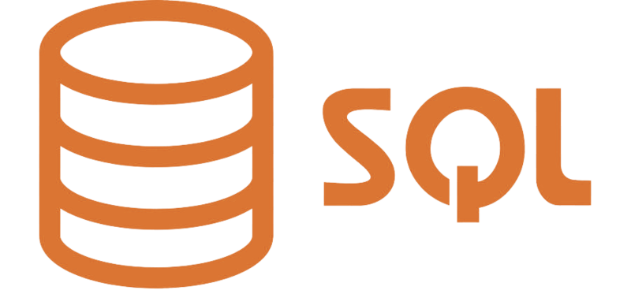
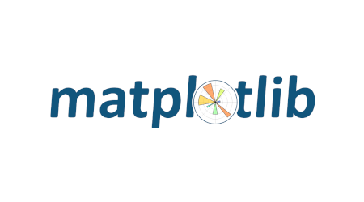
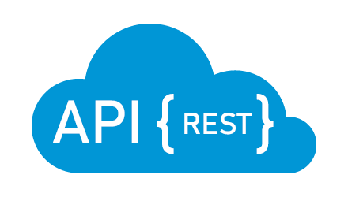
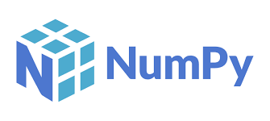
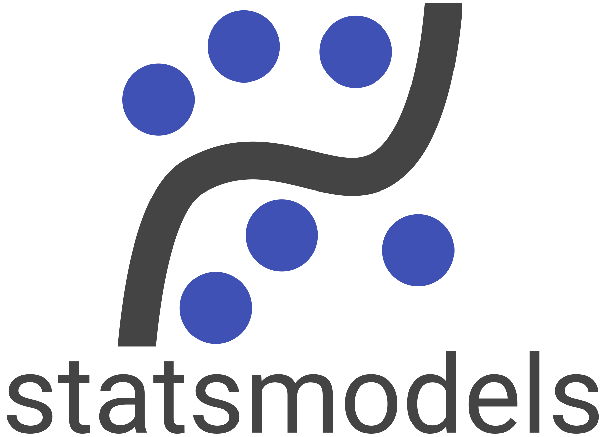
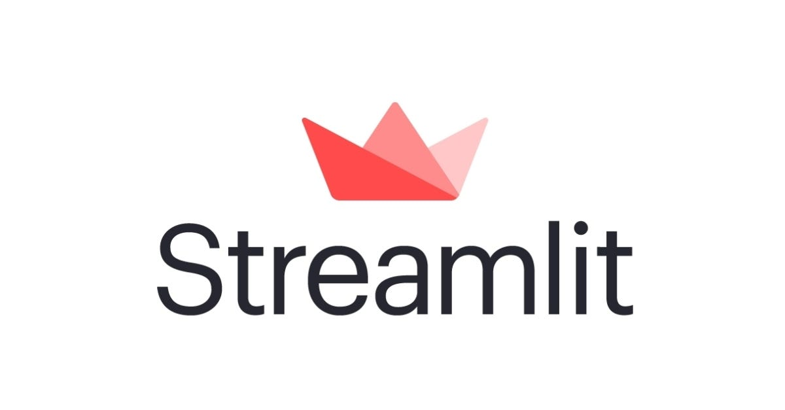
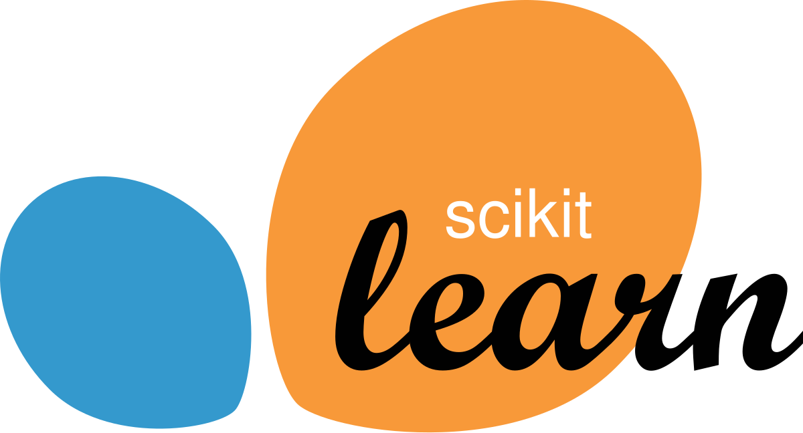
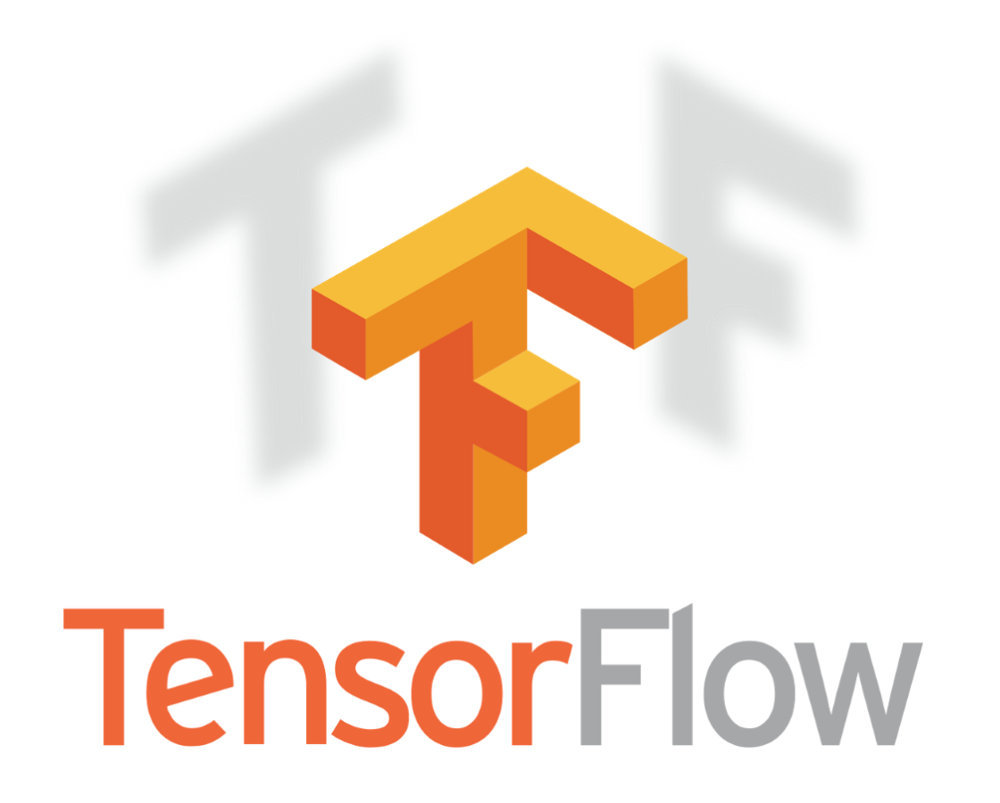

---
# the default layout is 'page'
icon: fas fa-info-circle
order: 1
title: "👋 Um Pouco Sobre Mim"
---

<!-- > Add Markdown syntax content to file `_tabs/about.md`{: .filepath } and it will show up on this page.
{: .prompt-tip } -->
<!-- display: flex; -->

    Olá! Sou Jefferson Rafael, graduando em Física pela UFRJ, cientista de dados e coordenador da área de competição na liga competitiva de ciência de dados da UFRJ, a <a href="https://analytica.ufrj.br/" target="_blank" style="color: orange; text-decoration: underline;">Analytica</a>. Minha paixão por entender o mundo e criar soluções inovadoras me levou à área de ciência de dados e machine learning, transformando dados em decisões estratégicas com impacto real. Meu <a href="/Jefferson-Cientista-de-Dados.pdf" target="_blank" style="color: orange; text-decoration: underline;">CV</a> e meu <a href="https://linktr.ee/jefferson_rafael" target="_blank" style="color: orange; text-decoration: underline;">contato</a>.

# 📊 **Experiências e impactos**
---

A Inteligência Artificial (IA) impulsiona inovação em empresas e sociedade, otimizando processos, elevando a produtividade e promovendo avanços em pesquisas científicas. Sua aplicação estratégica viabiliza soluções sustentáveis e impactantes em diversos setores.  

**Minha Contribuição Profissional e Acadêmica**  

Com experiência como pesquisador no Instituto Nacional de Tecnologia (INT) e coordenador na Analytica, aplico IA e ciência de dados para gerar impacto real. No INT, desenvolvi modelos de machine learning voltados para diagnósticos médicos e na Analytica, liderei projetos com tecnologias como TensorFlow, PyTorch, Scikit-Learn e IA Generativa, combinando habilidades técnicas e visão estratégica para entrega de resultados alinhados aos objetivos organizacionais.

## 🎓 **Contribuição em estudos científicos**
---

Contribui para o desenvolvimento do modelo preditivo usado no diagnóstico de doenças neurodegenerativas, como o Alzheimer.

## 🏆 **Liga competitiva de ciência de dados da UFRJ**
---

Eu lidero a área de competição da liga competitiva de ciência de dados da UFRJ, aplicando minhas **soft e hard skills** em desafios complexos. Eu aproveito essa oportunidade para demonstrar **alta performance** em problemas reais, utilizando **habilidades de dados** e **liderança**.

## [**Child Mind Institute - Problematic Internet Use**](https://jeffersonrafael.github.io/posts/CMI-PIU/)
---

É possível prever **o nível de uso problemático da internet exibido por crianças e adolescentes, com base em marcadores biológicos?** Nesta competição, eu desenvolvi um modelo preditivo que analisa os dados de atividade física e aptidão física das crianças para **identificar sinais precoces de uso problemático da internet**.

---

## [**Optiver Realized Volatility Prediction**](https://jeffersonrafael.github.io/posts/volatilidade-ia/)
---

Nesta competição, eu construi modelos que preveem a volatilidade de curto prazo para centenas de ações em diferentes setores. Eu lidei com centenas de milhões de linhas de dados financeiros altamente granulares à sua disposição, com os quais eu projetei meu modelo de previsão de volatilidade em períodos de 10 minutos. Os modelos são avaliados em relação aos dados reais do mercado coletados no período de avaliação de três meses após o treinamento.

---

<!-- ## [**The Learning Agency Lab - PII Data Detection**](https://www.kaggle.com/code/jeffersonrafael/0-964-pii-competi-o-analytica)
---

## [**LLM - Detect AI Generated Text**](https://www.kaggle.com/competitions/llm-detect-ai-generated-text/submissions)
---

## [**Home Credit - Credit Risk Model Stability**](https://www.kaggle.com/code/jeffersonrafael/jefferson-version-fork-of-home-credit-catboost)
--- -->

# 👨‍💻 **Tecnologias**
---

Ao longo da minha trajetória, acumulei **experiências relevantes e conquistas expressivas**, alavancando uma ampla gama de **ferramentas tecnológicas** para gerar impacto e resultados estratégicos.

## **Linguagens**
---

  

    
    
  

## **Visualization**
---

  

    
    
    
    
  

## **Automation**
---

  

    
    
    
  

## **Data Analysis**
---

  

    
    
    
    
    
    
  

## **Deployment**
---

  

    
  

## **Machine Learning & Deep Learning**
---

  

    
    
    
  

## **Web Scraping**
---

  

    
    
    
    
  

## **Versionamento**
---

  

    
    
  

---

Agradeço pela sua atenção! Convido você a explorar outras publicações para conhecer mais sobre minha trajetória profissional e os projetos que desenvolvi. Sua visita é fundamental para fortalecer nossa conexão.
